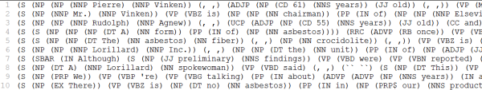
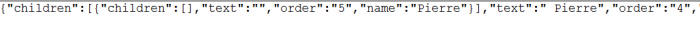
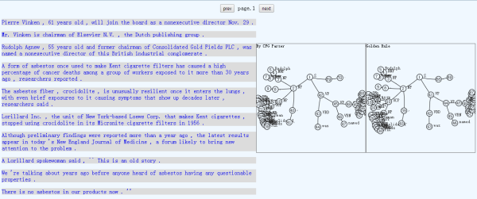
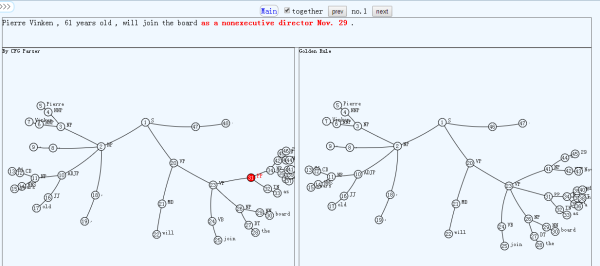
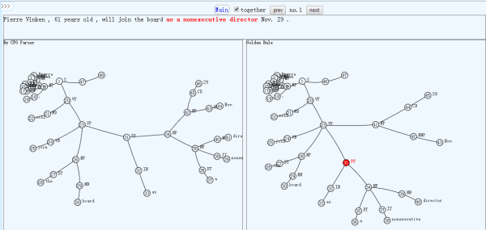

###constituent parsing visualization

####Project Description

In this project, I use html5 to visualize the differences between the results of constituent parsing algorithm and Golden Rule.In syntactic analysis, a constituent is a word or a group of words that functions as a single unit within a hierarchical structure. The analysis of constituent structure is associated mainly with phrase structure grammars.I show the data of both golden rule and the parsing algorithm results.This project uses a special structure called hyperbolic tree to draw the constituent parsing tree. 

####The data used

From the above picture, we can see the constituent parser format is recursively constructed with "(" and ")" . 
I use the stack to pretreat the data and transform the data to the following format：

####Notations for the network

The meaning of the nodes and edges are explained as following. 1) The nodes represent a word or a group of words that functions as a single unit  2) A node has index that indicate to the location of it in the result. 3) The edges indicate the inclusion relation.

####Notations for the project

From the picture above we can see many sentences, and I show the parsing tree which can be seen when the mouse is over any sentence. In this picture, I move the mouse over the third sentence, and we can see two parsing trees, of them the left one is the result of parsing algorithm while the right one is the result of Golden Rule. In parsing tree, a node represents a word and the line between nodes represents the inclusion relation. We can see which inclusion relation is wrong by comparing the two trees. So we can compare the results of Golden Rule and parsing algorithm conveniently.

We can click any sentence in the above picture and see this page. In this picture, the top shows the whole sentence.In the following parsing tree, the nodes are marked serial number in sentence. I draw the parsing tree by using a special tree called hyperbolic tree which can shift the focus, so we can see the part interested while other parts is not focused. In this picture, I move mouse over the node "PP" of the left parsing tree, and we can see which words it includes through the above sentence where those words are highlighted. 

In this picture, I move mouse to change the focus and the node 'PP' is selected in the right parsing tree. We can see which words it includes through the above sentence where those words are highlighted. And we can see the node "PP" includes different words in different parsings: the left is "as a nonexecutive director Nov. 29" while the right is "as a nonexecutive director", so this node "PP" is parsed falsely.

####Analysis

In this project, I visualize the text produced by the constituent parsing. By this text visualization, we can compare the structure of the two results and kown where is wrong in constituent parsing algorithm results.

###Others

github  address: [https://github.com/vis2014/Assignment3/tree/Wangle_A3](https://github.com/vis2014/Assignment3/tree/Wangle_A3 "Wangle_A3")

project address: [http://211.147.15.14/usr/wangl/nlpvis/cfg/1/](http://211.147.15.14/usr/wangl/nlpvis/cfg/1/ "project")
