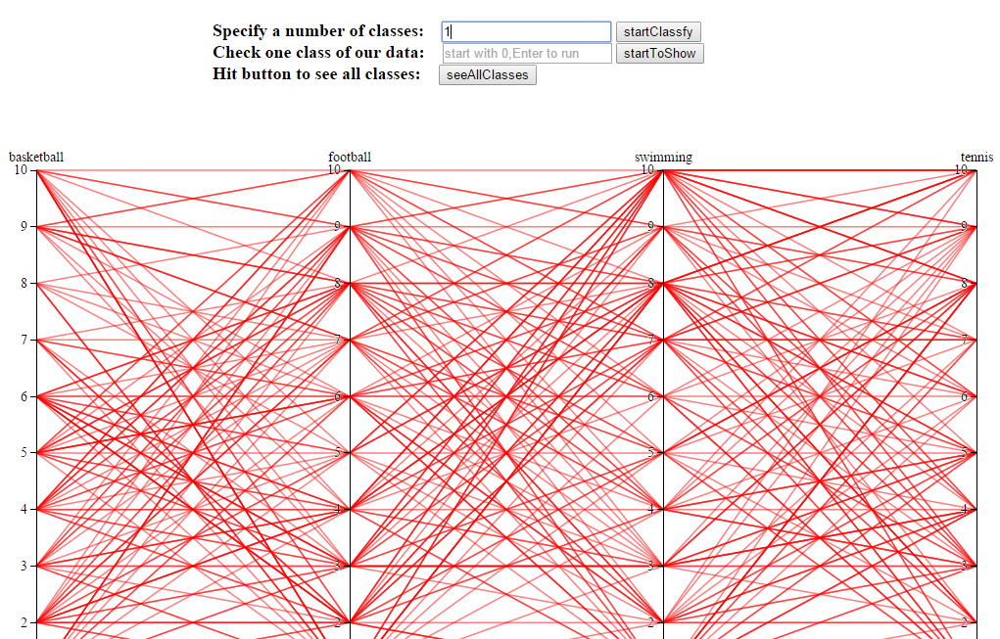
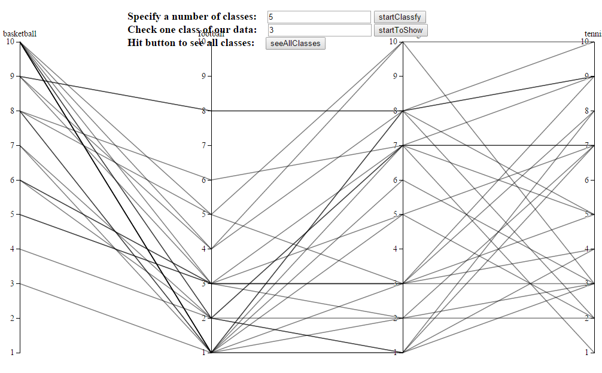

##Assignment2 link
[https://github.com/vis2014/Assignment2/tree/yijia_wangzhuo_A2](https://github.com/vis2014/Assignment2/tree/yijia_wangzhuo_A2)

__Attention, Final Score = 0.5 * Assigment2 + 0.5 Assignment3__

the partition at the course website is not correct, please ensure.

##copyright
__you can not use the source code before the final check by the teacher.__

designed by __wangzhuo__ and __yijia__.

##attention!!!!!
__we can not reach the [course website](http://211.147.15.14/UCAS_14_Fall/index.php/Home) at 16th,Nov,so we add wiki here.__ 

__Dear Mr Shi, we are so sorry. But we submit our on time at 11:00pm, 16th, Nov.__

##data source
We got the results from a questionnaire about favourite sports ranging from 0 to 10 points in network, and 151 students participated in the survey. The sports in the questionnaire are tennis,football,basketball and swimming. At last transform the results into a csv file.

The information in the csv file include __name__, __bastketball__,__football__,__tennis__,__swimming__ .

##description
*   Different from the iris-parallel example, there are no classified species before visualization, therefore we introduced the K-nearestNeighbour Algorithm to divide the students into different teams according to their favourite degree on the sports mentioned above automatically. 
*   But the user should input a number between 1 and 20 in the [input type="text"]() to specify the number of classes, then we'll show the lines in different color. Besides, one color means a different class from the others. 
*   Maybe all classes showed simultaneously is too massive, we offer an option to show specified class, what you need to do is just type a number between 0 and classNumber-1 in the second text area. After that, you could see the class of which the students have the similar favourites.
*   Click "seeAllClasses" button to see all classes you specified.

##Online
View our results at [http://yijia.ws/pages/hobbies.html](http://yijia.ws/pages/hobbies.html) online.

##offline
To see all effects, we recommand you to use firefox. If you must use chrome, please set your local server.

e.g., for python, you can type: __python -m SimpleHTTPServer 8888__, then you can visit [http://localhost:8888](http://localhost:8888).

##analysis
###classify the data into n parts
*	You can see just one kind of type when you type '1' .And you can type any number between 1 to 20 to see all kinds of types.
*	here are some screen shoots.

###check one class of our data
*	type a number in the second blank, you'll see one type of the data.
*	You can see at most 20 types of our data show by 20 different colors.
*	knn classify is used here.

###see all classes
*	when hit the button 'seeAllClasses', all of our data will show to you.
*	just enjoy.

