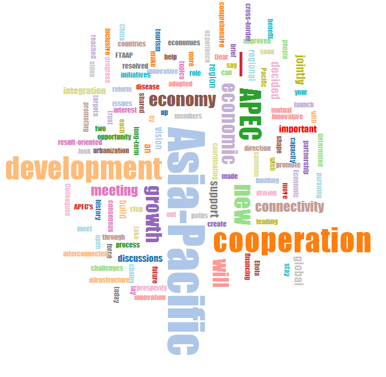

# Word Cloud Layout

This is a [Wordle](http://www.wordle.net/)-inspired word cloud layout written
in JavaScript. It uses HTML5 canvas and sprite masks to achieve
near-interactive speeds.

See [here](http://www.jasondavies.com/wordcloud/) for an interactive
demonstration along with implementation details.

###1. Data source: 
+ Closing Remarks by H.E. Xi Jinping President of the People's Republic of China At the 22nd APEC Economic Leaders' Meeting.

###2. Creation:
+ This project based on the [example](https://github.com/jasondavies/d3-cloud) on wiki.

#### What's new:
+ a.The words now will load from a txt file instead of input words one by one.
+ b.The size of a word depends on the frequency it appear in the article instead of random.
+ c.Punctuation,conjuction and pronoun and some other words like"I","You","of","and","this","the" and so no won't show any more.
+ d.Add some interactions:When the mouse point a word,it's color will change to red.

###3.Conclusion:
+ top  frequent words:"Asia-Pacific”,“APEC” ,“development”,“economic”,“growth”,“coopertation”,“connectivity".
+ a."Asia-Pacific" and"APEC " indicate the speech was addresed in the APEC conference.
+ b."development ,"economic",and "growth" tell us the APEC conference is about the ecomnomy and development affairs.
+ c."coopertation" and "connectivity" show that the president attached much importance to the cooperation with other countries in his speech.

###4. Teammates:
+ 赵睿，张琦
